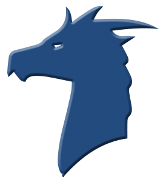
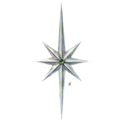
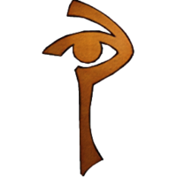
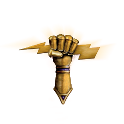
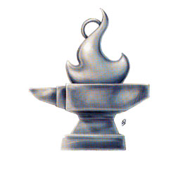
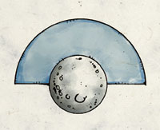
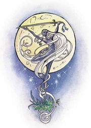
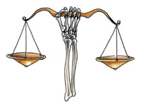

There was a time when everything was still. All the creatures of the earth were asleep &mdash; or nearly all. The Great Father of All was the only one awake. Gently, he awoke Pelor. As he opened his eyes, a ray of warm light spread out across the sleeping earth. 

"Pelor, I have work for you." he said "Go down to the earth and awake the sleeping spirits. Give them purpose. 

Pelor glided down to earth and saw that it was bare. But he awoke and called together the great spirits, and together they fashioned the world and all its creatures and all the folk that would live there.

These spirits were...

##The Gods of the Pantheon##

<h3 style="text-align:center;margin-bottom:0;">Avandra</h3>

Chaotic Good

The god of change, Avandra delights in freedom, trade, travel, adventure, and the frontier. Her temples are few in civilized lands, but her wayside shrines appear throughout the world. Halflings, merchants, and all types of adventurers are drawn to her worship, and many people raise a glass in her honor, viewing her as the god of luck.

Her commandments are few: 

* Luck favors the bold. Take your fate into your own hands, and Avandra smiles upon you.
* Strike back against those who would rob you of your freedom and urge others to fight for their own liberty.
* Change is inevitable, but it takes the work of the faithful to ensure that change is for the better.

<h3 style="text-align:center;margin-bottom:0;">Bahamut</h3>

Lawful Good

Called the Platinum Dragon, Bahamut is the god of justice, protection, nobility, and honor. Lawful good paladins often revere him, and metallic dragons worship him as the first of their kind. Monarchs are crowned in his name.

He commands his followers thus:

* Uphold the highest ideals of honor and justice.
* Be constantly vigilant against evil and oppose it on all fronts.
* Protect the weak, liberate the oppressed, and defend just order. 

<h3 style="text-align:center;margin-bottom:0;">Corellon</h3>

Chaotic Good

The god of thawing, beauty, and the arts, Corellon is the patron of arcane magic and the fey. He seeded the world with arcane magic and planted the most ancient forests. Artists and musicians worship him, as do those who view their spellcasting as an art. He despises Lolth and her priestesses for leading the drow astray. Sehanine is his wife, and they are revered by Elves above all other gods.

He urges his followers thus:

* Cultivate beauty in all that you do, whether you’re casting a spell, composing a saga, strumming a lute, or practicing the arts of war.
* Seek out lost magic items, forgotten rituals, and ancient works of art. Corellon might have inspired them in the world’s first days.
* Thwart the followers of Lolth at every opportunity. 

<h3 style="text-align:center;margin-bottom:0;">Erathis</h3>

Lawful Good

Erathis is the god of civilization. She is the muse of great invention, founder of cities, and author of laws. Rulers, judges, pioneers, and devoted citizens revere her, and her temples hold prominent places in most of the subcontinents’s major cities. Her husband is Pelor, and together they lead the pantheon.

Her laws are many, but their purpose is straightforward:

* Work with others to achieve your goals. Community and order are always stronger than the disjointed efforts of lone individuals.
* Tame the wilderness to make it fit for habitation, and defend the light of civilization against the encroaching darkness.
* Seek out new ideas, new inventions, new lands to inhabit, new wilderness to conquer. Build machines, build cities, build empires. 

<h3 style="text-align:center;margin-bottom:0;">Ioun</h3>

True Neutral

Ioun is the god of knowledge, skill, and prophecy. Sages, seers, and tacticians revere her, as do all who live by their knowledge and mental power. Corellon is the patron of arcane magic, but Ioun is the patron of its study. Libraries and wizard academies are built in her name. 

Her commands are also teachings:

* Seek the perfection of your mind by bringing reason, perception, and emotion into balance with one another.
* Accumulate, preserve, and distribute knowledge in all forms. Pursue education, build libraries, and seek out lost and ancient lore.
* Be watchful at all times for the followers of Vecna, who seek to control knowledge and keep secrets. Oppose their schemes, unmask their secrets, and blind them with the light of truth and reason. 

<h3 style="text-align:center;margin-bottom:0;">Kord</h3>

Chaotic Neutral

Kord is the storm god and the lord of battle. He revels in strength, battlefield prowess, and thunder. Fighters and athletes revere him. He is a mercurial god, unbridled and wild, who summons storms over land and sea; those who hope for better weather appease him with prayers and spirited toasts. 

He gives few commands:

* Be strong, but do not use your strength for wanton destruction.
* Be brave and scorn cowardice in any form.
* Prove your might in battle to win glory and renown.

<h3 style="text-align:center;margin-bottom:0;">Melora</h3>

Chaotic Good

Melora is the god of the wilderness and the sea. She is both the wild beast and the peaceful forest, the raging whirlpool and the quiet desert. Rangers, hunters, and elves revere her, and sailors make offerings to her before beginning their voyages. 

Her strictures are these:

* Protect the wild places of the world from destruction and overuse. Oppose the rampant spread of cities and empires.
* Hunt aberrant monsters and other abominations of nature.
* Do not fear or condemn the savagery of nature. Live in harmony with the wild. 

<h3 style="text-align:center;margin-bottom:0;">Moradin</h3>

Lawful Good

Moradin is the god of creation and patron of artisans, especially miners and smiths. He carved the mountains from primordial earth and is the guardian and protector of the hearth and the family. He and his wife Berronar created the Dwarves and stand at the head of their pantheon.

He demands these behaviors of his followers:

* Meet adversity with stoicism and tenacity.
* Demonstrate loyalty to your family, your clan, your leaders, and your people.
* Strive to make a mark on the world, a lasting legacy. To make something that lasts is the highest good, whether you are a smith working at a forge or a ruler building a dynasty.

<h3 style="text-align:center;margin-bottom:0;">Pelor</h3>

Neutral Good

God of the sun, Pelor is the keeper of time. He supports those in need  and opposes all that is evil. He is Chief of the Gods, and husband of Erathis. As the lord of agriculture and the bountiful harvest, he is the deity most commonly worshiped by ordinary humans, and his priests are well received wherever they go. Paladins and rangers are found among his worshipers. 

He directs his followers thus:

* Alleviate suffering wherever you find it.
* Bring Pelor’s light into places of darkness, showing kindness, mercy, and compassion.
* Be watchful against evil. 

<h3 style="text-align:center;margin-bottom:0;">Sehanine & Eilistraee</h3>

Neutral Good

**Sehanine** God of mysteries and the major moon, Sehanine is the patron of trickery and illusions. She is the wife of Corellon, has close ties to Melora and is a favorite deity among elves and halflings. She is also the god of love, who sends shadows to cloak lovers’ trysts. Scouts and thieves ask for her blessing. 

She teaches:

* Follow your goals and seek your own destiny.
* Keep to the shadows, avoiding the blazing light of zealous good and the utter darkness of evil.
* Seek new horizons and new experiences, and let nothing tie you down.

Her daughter, **Eilistraee**, "the Dark Dancer," represents moonlight and the lesser moon. She is also god of song & dance, swordwork, charity, and beauty. She is patron of the Drow who live on the surface and those Drow in the underdark who would live in peace with the surface dwellers. She is allied with Nusemnee.

Her teachings are:

* Bring happiness and merriment everywhere you go, lifting people's hearts with kindness, gaiety, songs, jests and revelry. 
* Help the drow to forge their own place in the world and become part of its rightful, nonevil inhabitants. 
* Strangers are your friends. Hungry travelers are to be fed and the homeless are to be given shelter.

<h3 style="text-align:center;margin-bottom:0;">Kelemvor</h3>

Lawful Neutral

Kelemvor is also known as the Lord of the Dead or Judge of the Damned. They mark the end of each mortal life, and mourners call upon them during funeral rites, in the hope that they will guard the departed from the curse of undeath. 

They expect their followers to abide by these commandments:

* Recognise that death is a part of life. It is not an ending but a beginning, not a punishment but a necessity.
* Help others die with dignity at their appointed time and no sooner. Act against those that would artificially prolong their life beyond natural limits.
* Do honor to the dead, for their strivings in life brought us to where we are now. To forget them is to forget part of yourself.

###The Black Gods###

These deities —whose worship isn't sanctioned by the priests of the pantheon gods— are evil. While sometimes these deities aid the pantheon, at others, they work against them or aid their enemies. They have their own cults, attracting social outcasts and villains to their worship, exhorting these followers to pursue evil ends or commit destructive deeds.

**Asmodeus** is the god of the Nine Hells. He is patron of the powerful, god of tyranny and domination, and the commander of devils.

**Loviatar** is the god of war and conquest. Militaristic nations of humans and goblins serve her and conquer in her name. 
Gruumsh is the god of destruction, and overlord of marauding barbarian hordes. Where Loviatar commands conquest, Gruumsh exhorts his followers to slaughter and pillage. Orcs are his most fervent followers.

**Lolth** is the god of shadow, lies, and spiders. Scheming and treachery are her commands, and her clerics are a constant force of disruption in the otherwise stable society of the evil drow. 

**Tiamat** is the evil god of wealth, greed, and envy. She urges her followers to take vengeance for every slight, and she is the patron of chromatic dragons.

**Torog** is the god of the Underdark, patron of jailers and torturers. Common superstition holds that if his name is spoken, the King that Crawls will burrow up from below and drag the hapless speaker underground to an eternity of imprisonment and torture. 

**Vecna** is the god of undead, necromancy, and secrets. He rules that which is not meant to be known and that which people wish to keep secret. 

**Zehir** is the god of darkness, poison, and assassins. Snakes are his favored creation, and the yuan-ti revere him above all other gods.

<h3 style="text-align:center;margin-bottom:0;">Nusemnee</h3>

Neutral Good

The daughter of Zehir and a powerful devil was originally one of her father's assassins, but was redeemed by a High Priest of Pelor she tried to kill when he saved her from death. Now she is the god of redemption, heroism, and hope; and the girlfriend of Eilistraee. Her worship is tolerated by priests of the Pantheon, but not encouraged &mdash; it is opposed by the priests of the Dark Gods as she purges the evil from a mortal's soul as soon as they seek redemption. Numerous redeemed antipaladins enter her service.

* It is never too late to seek redemption
* True heroism does not come from good deeds. It comes from doing good when it matters.
* Nobody is perfect. Those who seek to be perfect will fail. It is not a shame to fail, and it is not a waste to try.
* A man is better than the worst thing he has ever done.
