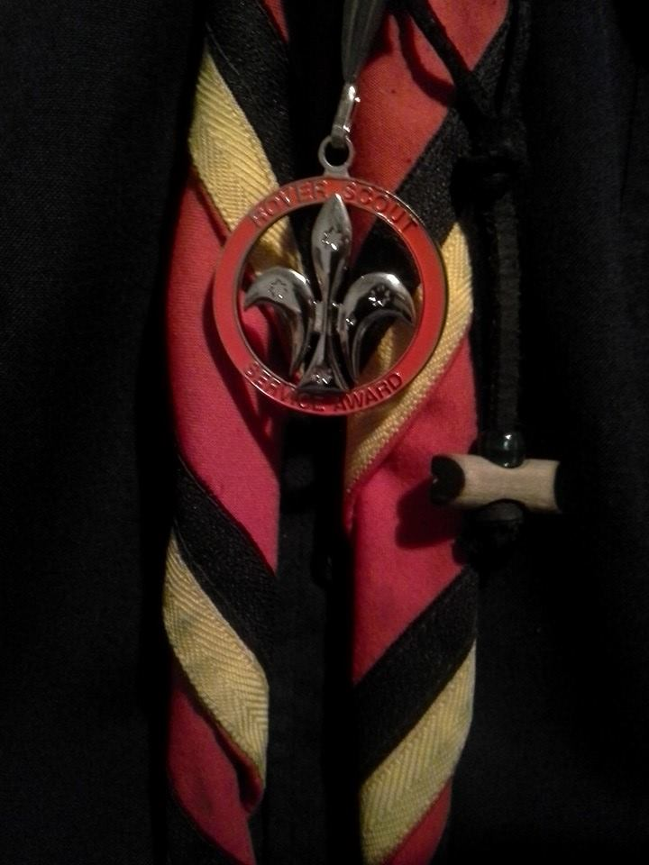

<em>This is (more or less) the speech I made when I was presented with the <a href="http://www.vicrovers.com.au/awards/wf-waters/" target="_blank">WF Waters Rover Service Award</a> at the 2014 Rover Dinner at Albert Park.</em>

  
  <em style="display:table; margin-left:auto; margin-right:auto; font-size:12px;">The medallion</em>

I was once told that long-term planning for Rovers can be summed up as “what do you want to see when you look over your shoulder, as you pause, at the door, walking out after your Boot?” With my own boot coming up next week, I've been thinking a lot about this recently.

The changes that I’ve seen in the Rover Section over the past eight years, were proposed by Rovers and were implemented by Rovers (with help from RAs and Booted Rovers). Extraordinary Rovers = Extraordinary Crews, Rovering Towards 2020, and even the biannual Vicrovers strategic plan, we’ve had plenty of chances to examine where we are and where we want to go at State level, but do we do that as Crews, and as individuals?

If there is something that can make your Rovering experience better, get out there and make it happen.

* Build something at the Park.
* Start a new event.
* Or just take ownership of a part of our program, and make it better for everyone.

Many of you will play important parts in the 20th Australian Moot over the next three years, but others will take up the even more important challenge of maintaining our three Rover assets, supporting 120 Rover Crews and running the headline events that bring Rovers from across the country, and the world, to Victoria every year.

Of course, you will all be involved in delivering the Crew program to individual Rovers.

When Harold Gardiner died, I noted that Victorian Rovers was able to do much of what it is that we do because we stand on the shoulders of giants, or to speak plainly, you build on the work of those who came before you.

I can assure you that getting state-level feedback that something you’ve been championing for years is considered ‘expected’ by the membership  is every bit as satisfying as standing here, in this spot at a Rover Dinner.

So. What do **you** want to Rovers to look like, when you walk out of your Boot?

How will **you** make that happen?

Thank you for listening, thank you for the recognition.

Thank you for your support over the past eight years.

Good night.